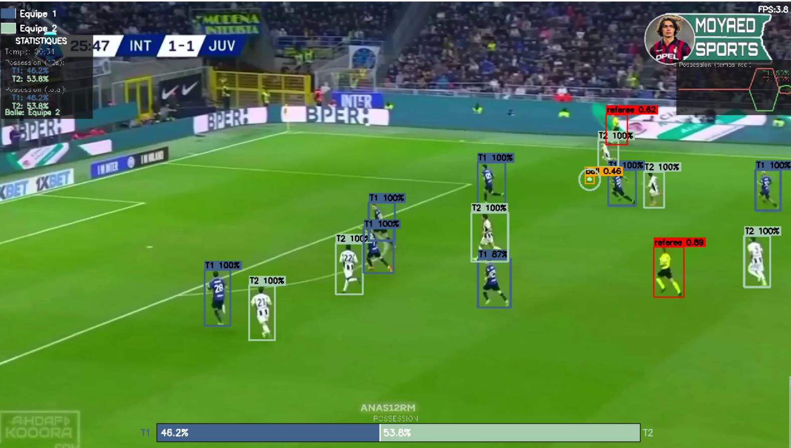
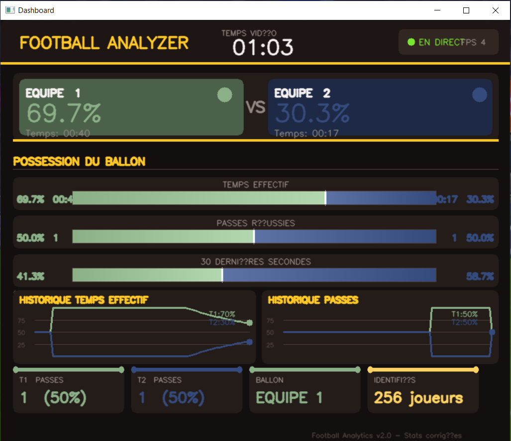

# ⚽ Football Analyzer v2.0

Système d'analyse footballistique en temps réel avec :
- ✅ Détection YOLO (joueurs, ballon, arbitres)
- ✅ Suivi IOU multi-objet
- ✅ Classification d'équipes (GMM)
- ✅ Calcul possession (temps & passes)
- ✅ Dashboard professionnel

## 📁 Structure

```
football-analyzer/
├── main.py                    # Point d'entrée
├── config.py                  # Configuration centralisée
├── requirements.txt           # Dépendances
├── README.md                  # Cette doc
└── modules/
    ├── __init__.py
    ├── tracker.py            # SimpleTracker (IOU)
    ├── team_classifier.py    # TeamClassifierGMM
    ├── possession.py         # PossessionTracker
    ├── dashboard.py          # FootballDashboard
    ├── detector.py           # Détecteur YOLO
    └── analyzer.py           # Orchestration
```

## 🚀 Installation

```bash
pip install -r requirements.txt
```

## ⚙️ Configuration

Modifier `config.py` :

```python
MODEL_PATH = r''
VIDEO_PATH = r''
DEFAULT_FPS = 30.0
```

## ▶️ Utilisation

```bash
python main.py
```

### Contrôles
- **p** : Pause/Play
- **r** : Reset analyseur
- **q** : Quitter

## 📊 Sortie

### Fenêtre "Camera"
- Boîtes englobantes colorées (par équipe)
- IDs de suivi
- Ballon entouré de la couleur équipe


### Fenêtre "Dashboard"
- Possession en % (temps & passes)
- Historiques (30 dernières secondes)
- Statistiques joueurs identifiés
- Progression calibration

## 🔧 Modules

### `detector.py`
Détection YOLO + extraction couleurs maillots

### `tracker.py`
Suivi multi-objet basé sur IOU

### `team_classifier.py`
Classification équipes avec Gaussian Mixture Model

### `possession.py`
Calcul possession, passes, statistiques

### `dashboard.py`
Rendu visuel professionnel

### `analyzer.py`
Orchestrateur principal (combine tous les modules)

### `config.py`
Toutes les constantes et paramètres

## 📈 Statistiques

Le système calcule :
- **Possession temps** : % de temps par équipe
- **Possession passes** : % de passes par équipe
- **Passes** : nombre total par équipe
- **Fenêtre mobile** : possession sur 30s
- **Frames brutes** : debug et vérification

## 🎯 Processus Calibration

1. Les 80 premiers frames : collecte des couleurs
2. GMM sur les 2 clusters (2 équipes)
3. Mapping couleurs → équipes
4. Prédiction stable avec lissage temporel

## 💡 Améliorations Possibles

- [ ] Export vidéo annotée
- [ ] API REST
- [ ] Détection formation
- [ ] Segmentation terrain
- [ ] Statistiques joueur (distance, passe, etc)
- [ ] Multi-caméra

## 📝 Licence

MIT

## 👨‍💻 Auteur

mohamed amine gotai 
etudiant data scientist

**v2.0** - Refactorisation modulaire complète ✨